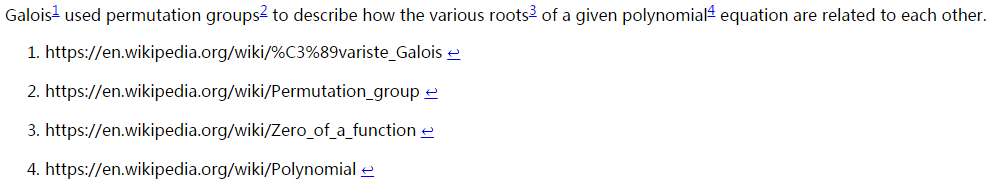

Footnote is not supported by original markdown, it is still supported by many
markdown dialect.

For example, the following words from [wikipedia](https://en.wikipedia.org/wiki/Galois_theory):

```
Galois[^1] used permutation groups[^2] to describe how the various roots[^3] of a given polynomial[^4] equation are related to each other.

[^1]: https://en.wikipedia.org/wiki/%C3%89variste_Galois
[^2]: https://en.wikipedia.org/wiki/Permutation_group
[^3]: https://en.wikipedia.org/wiki/Zero_of_a_function
[^4]: https://en.wikipedia.org/wiki/Polynomial
```

Using [karmdown](http://kramdown.gettalong.org/) got


