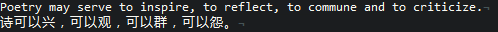

To set two different font for english and chinese in vim, we need to use `guifontwide`.

As vim doc says:

> When not empty, specifies a comma-separated list of fonts to be used for double-width characters.  The first font that can be loaded is used.

> ...

> `guifontwide` is only used when `encoding` is set to "utf-8" and `guifontset`
is empty or invalid.

> When `guifont` is set and a valid font is found in it and `guifontwide` is empty Vim will attempt to find a matching double-width font and set `guifontwide` to it.

for me, the following lines works just fine

```vim
set encoding=utf8
set guifont=Consolas:h10
set guifontwide=Microsoft\ Yahei\ Mono:h10
```

